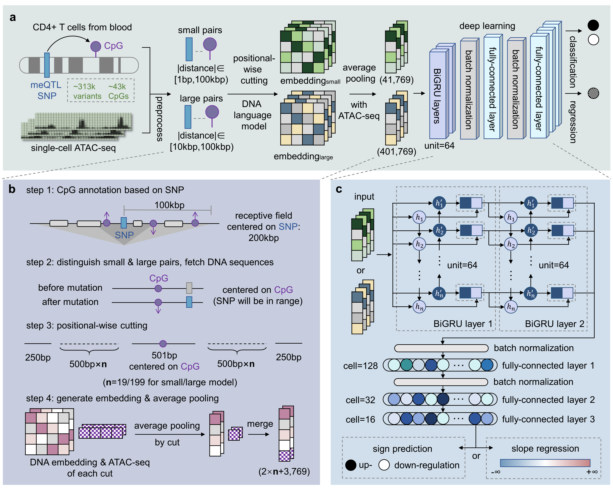

# Methven
Predicting the effect of non-coding mutations on single-cell DNA methylation using DNA language model.

<p align="center"></p>

## Environment
- Python == 3.9
- Tensorflow-gpu == 2.7
- Protobuf == 3.20
- Scikit-learn == 1.1

## Running interface
Please download the reference genome and the pretrained model weights from the [Cloud Storage](https://www.psymukb.net:83/Methven_Download/). 
Please keep the same file relative path as when you downloaded it, and the program will automatically identify which model to use.   

> Step 1: prepare input embedding
Please prepare the running environment of [DNABert2](https://github.com/MAGICS-LAB/DNABERT_2) or use [dnabert2.yaml](https://github.com/Liuzhe30/Methven/tree/main/enrironment/dnabert2.yaml).
```shell
source activate dnabert2
```
```python
import numpy as np
from src.utils_prepare_embedding import *
# input examples
input_variant = 'chr1_85591599_G_A' # hg19, only single-point mutation accepted
cpg_position = 85600447
atac_seq = np.random.rand(20_001) # centered on CpG site, 20,001bp for 'Methven-small' model and 200,001bp for 'Methven-large' model

# Define the genome path
genome_path = '/reference_genome_hg19/' # In this case, '/reference_genome_hg19/chr1.fasta' will be used.
embedding = get_embedding(input_variant, cpg_position, atac_seq, genome_path)
```
> Step 2: run Methven
Please create the running environment of Methven or use [methven.yaml](https://github.com/Liuzhe30/Methven/tree/main/enrironment/methven.yaml).
```shell
source activate methven
```
```python
from src.utils_sign_prediction import *
from src.utils_slope_prediction import *

# Define path of downloaded data
download_path = '/Methven_Download/' # In this case, the weights from '/Methven_Download/small/weights/' will be used.

# Get sign prediction output
sign_prediction_output = get_sign_prediction_result(download_path) 
print(sign_prediction_output) # 'Up-regulation' or 'Down-regulation'

# Get slope prediction output
slope_prediction_output = get_slope_prediction_result(download_path) 
print(slope_prediction_output) # Absolute value of slope, consider labeling mutations as 'no effect' when the value is small
```

## Training
You can specify the model size and other hyper-parameters through the command:
```shell
cd [work_path]
python training.py -m small --epoch 100 --lr 0.005 --save_dir model/weights/
```
Note: 
- When using the preprocessing scripts and the parameters of Methven to process and predict on your own dataset, place all **Reference Allele** to the "before mutation" input branch for hg19 sequence alignment.

## Evaluating and predicting
Please prepare your datasets when predicting the results, and choose the model size in the script.
```shell
cd [work_path]
python evaluation.py
```

## Processed training dataset and model weights
|model|trained weights|parameter|slope trained weights|processed training data|test data|
|:---:|:---:|:---:|:---:|:---:|:---:|
|Small|[Download](https://www.psymukb.net:83/Methven_Download/small/weight/)|722,786|[Download](https://www.psymukb.net:83/Methven_Download/small/weight_slope/)|[Download](https://www.psymukb.net:83/Methven_Download/small/data/small_train.dataset)|[Download](https://www.psymukb.net:83/Methven_Download/small/data/small_test.dataset)|
|Large|[Download](https://www.psymukb.net:83/Methven_Download/large/weight/)|814,946|[Download](https://www.psymukb.net:83/Methven_Download/large/weight_slope/)|[Download](https://www.psymukb.net:83/Methven_Download/large/data/large_train.dataset)|[Download](https://www.psymukb.net:83/Methven_Download/large/data/large_test.dataset)|

## Raw data
|Data|resource|
|:---:|:---:|
|single-cell meQTL(CD4+ T cell, Monocyte)|[EPIGEN MeQTL Database](https://epicmeqtl.kcl.ac.uk/ )|
|single-cell ATAC-seq(CD4+ T cell, Monocyte)|[EpiMap](https://personal.broadinstitute.org/cboix/epimap/metadata/Short_Metadata.html)|
|GRCh37/hg19 genome|[UCSC Genome Browser](https://genome.ucsc.edu/cgi-bin/hgGateway)|
|Regulation annotation (hg19)|[UCSC Genome Browser](https://genome.ucsc.edu/cgi-bin/hgTables?db=hg19)|
|Unstimulated and 24hr stimulated RA ATAC-seq|[GWAS summary statistics](http://plaza.umin.ac.jp/~yokada/datasource/software.htm)|
|RA-associated SNPs|[GEO Series accession](https://www.ncbi.nlm.nih.gov/geo/query/acc.cgi?acc=GSE138767)|
